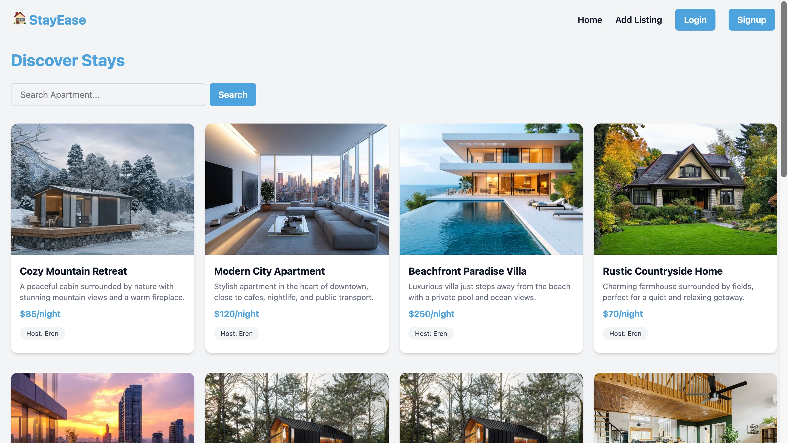
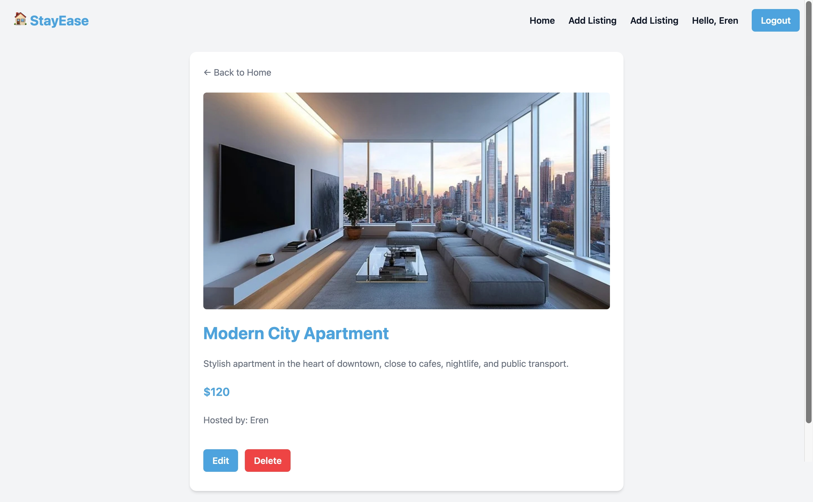
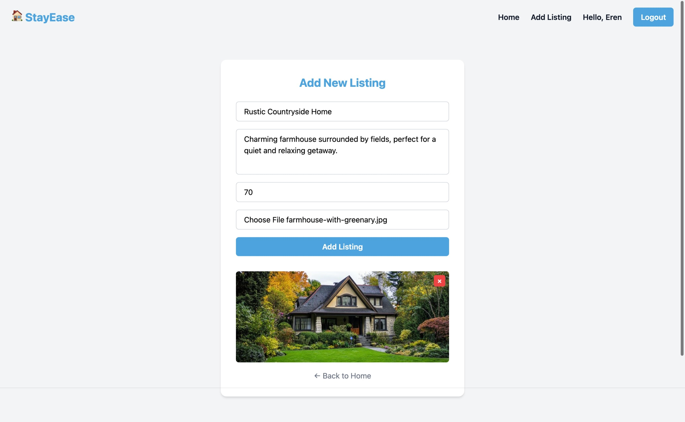

# 🏠 StayEase

**StayEase** is a full-stack Airbnb-inspired platform where users can explore, create, and manage property listings with authentication and image uploads.

---

## 🚀 Features

- 🔐 User Authentication (JWT)
- 🏡 Create, Read, Update, Delete Listings
- 🖼️ Image Upload (Cloudinary)
- 🔎 Search Listings
- 👤 Ownership-based access (only owner can edit/delete)
- 📱 Responsive UI

---

## 🛠️ Tech Stack

### Frontend

- React
- Axios
- React Router

### Backend

- Node.js
- Express.js
- MongoDB (Mongoose)
- JWT Authentication
- Multer (file upload)
- Cloudinary (image storage)

---

## 📂 Project Structure

```
backend/
  controllers/
  middleware/
  models/
  routes/
  utils/
  config/

frontend/
  components/
  pages/
```

---

## ⚙️ Environment Variables

Create a `.env` file in backend:

```
MONGO_URI=your_mongodb_uri
JWT_SECRET=your_secret_key
CLOUDINARY_CLOUD_NAME=xxx
CLOUDINARY_API_KEY=xxx
CLOUDINARY_API_SECRET=xxx
PORT=5000
```

---

## ▶️ Run Locally

### Backend

```
cd backend
npm install
npm run dev
```

### Frontend

```
cd frontend
npm install
npm start
```

---

## 🌐 Live Demo

👉 Add your deployed link here

---

## 💡 What I Learned

- Handling authentication with JWT
- Building REST APIs with Express
- Managing file uploads with Multer & Cloudinary
- Structuring scalable backend with controllers & middleware
- Full-stack integration (MERN)

---

## 📸 Screenshots

### 🏠 Home Page



### 📄 Listing Details



### ➕ Add Listing



---

## 📬 Contact

Feel free to connect or reach out!

- 💻 GitHub: [sujwal19](https://github.com/sujwal19)
- 🔗 LinkedIn: [Sujwal Dhungana](https://linkedin.com/in/sujwal)
- ✉️ Email: dsujwal24@email.com
